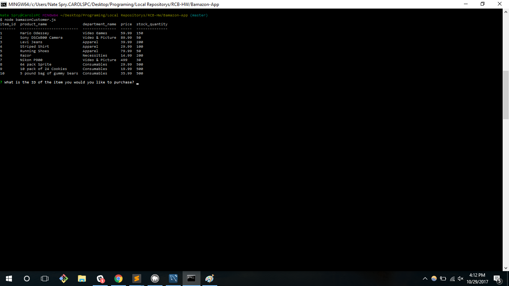
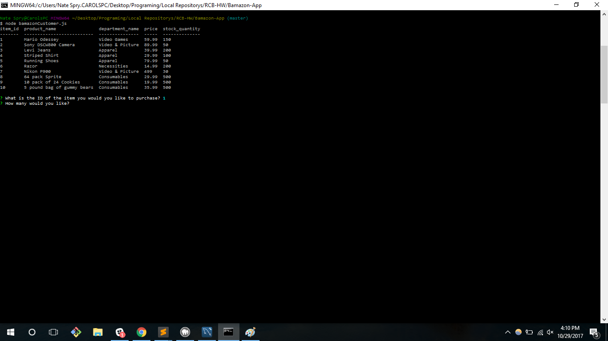
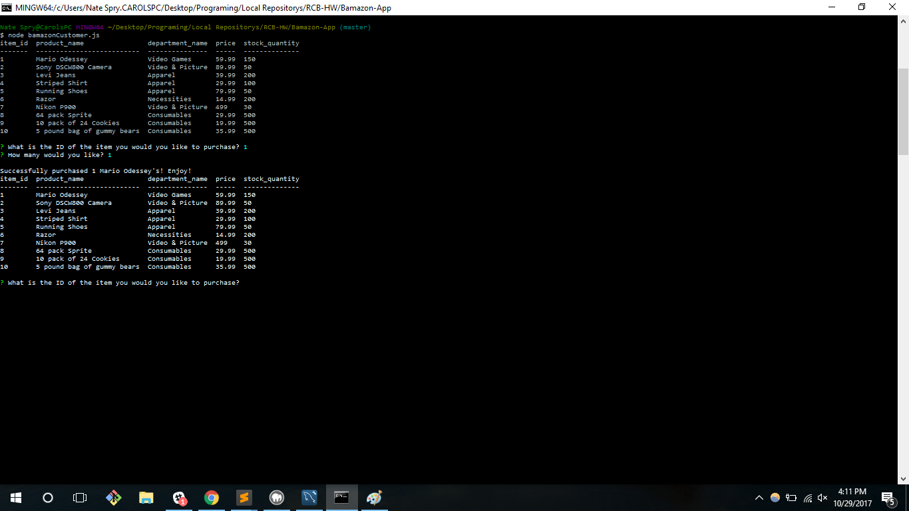
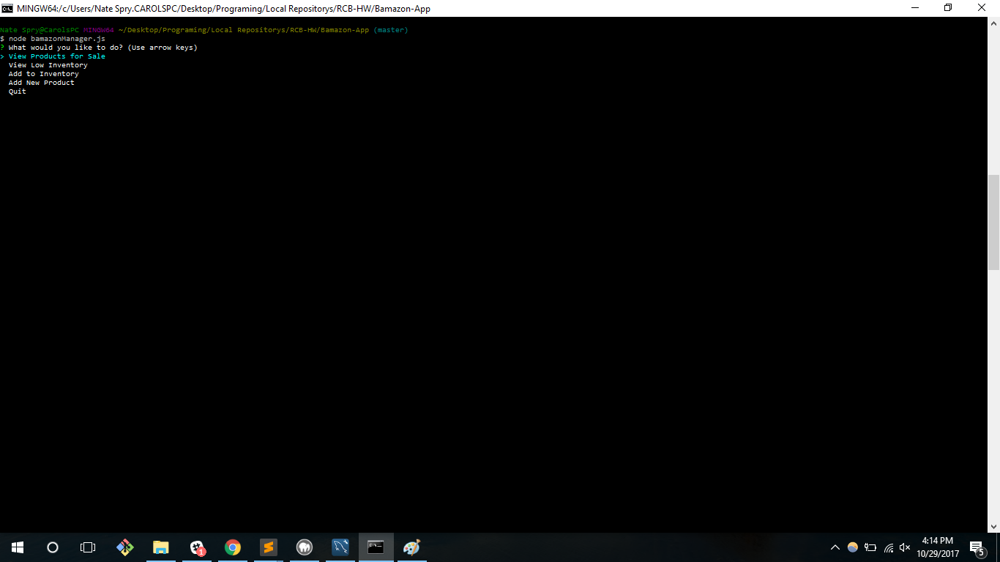

# Bamazon-App

## User's Guide
This application will allow you to access our Bamazon database and make purchases on our items!

Once the user boots up our app, the first thing they will be prompted with is this screen:

Then, you pick what item you would want to purchase. Here we will pick Odessey.

Select how many you want. We're just going to get one copy.

And then you are prompted with a successful purchase! Enjoy your copy of Odessey!

## Manager's Guide
As the manager, you want the ability to change the information in the database. So here is how you do that:

Here you are prompted with 4 options:
+ Viewing the products for sale
+ Checking low inventory
+ Adding to the inventory of an existing product
+ Adding a product for sale

These functions give you the ability to run your Bamazon like you want!

There is also a quit option should you choose to exit the prompt.